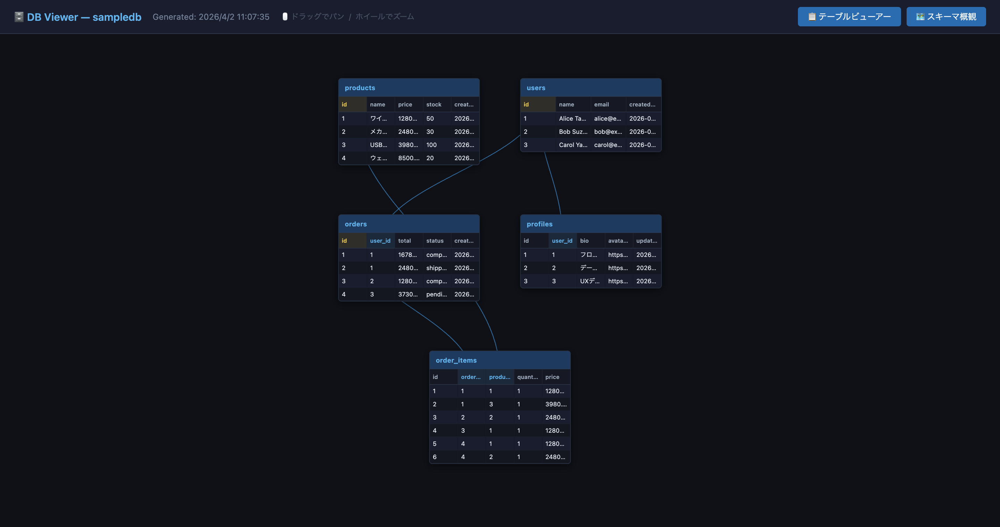
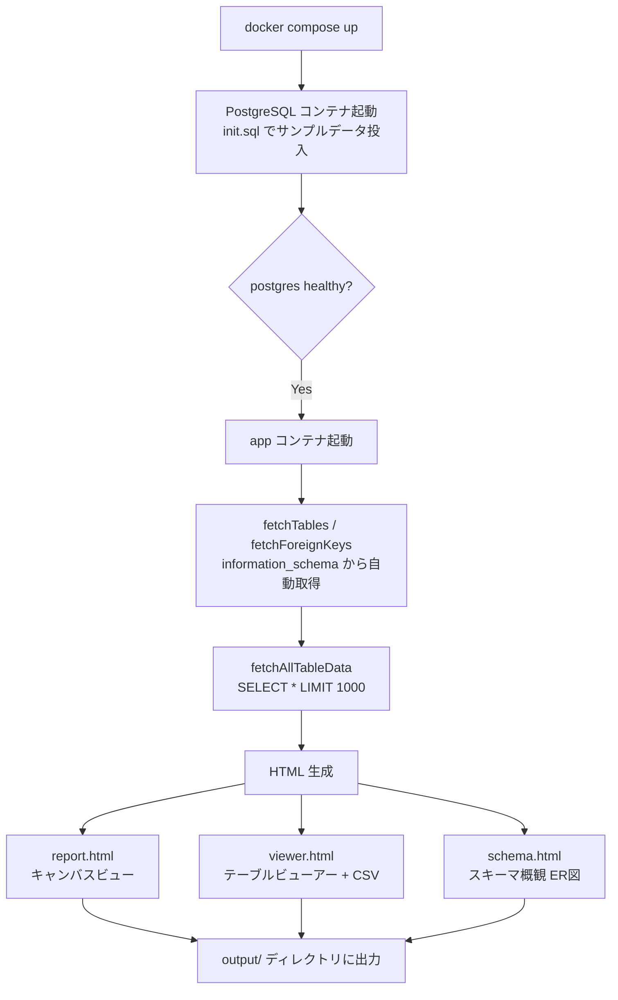
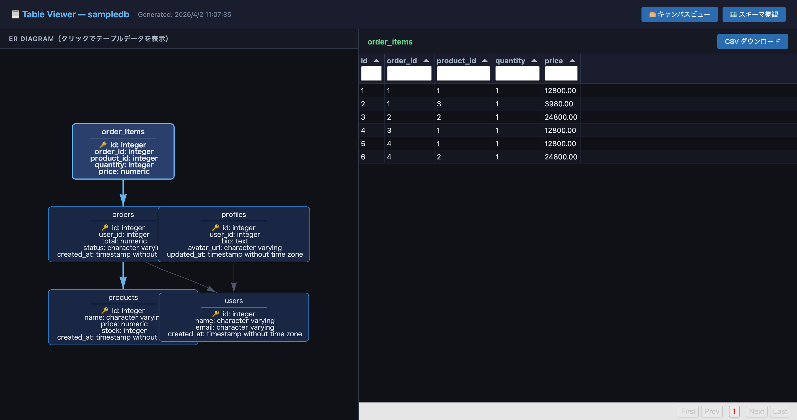
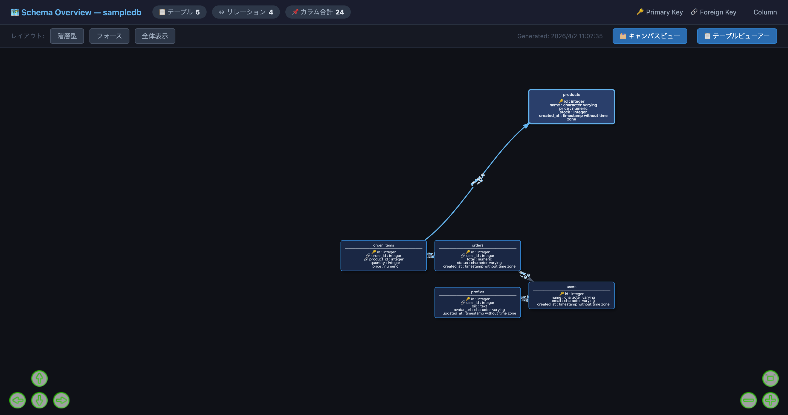

# 🗄 db-canvas-viewer

[](https://opensource.org/licenses/MIT)
[](https://www.typescriptlang.org/)
[](https://nodejs.org/)
[](https://www.postgresql.org/)
[](https://www.docker.com/)

> **PostgreSQL のデータベース構造とデータを、3種類のビューで視覚的に確認できるHTMLレポート生成ツール**



## 📖 概要

`db-canvas-viewer` は、PostgreSQL に接続してテーブル構造・外部キー・実データを自動取得し、インタラクティブなHTMLレポートとして出力するCLIツールです。

SQL を書かなくてもデータベース全体の構造とデータを直感的に把握できます。初学者がデータベースの「全体像」を視覚的に理解することを目的として作られました。

### なぜ作ったのか

- SQLでデータ構造を確認するのが難しく、視覚的にデータベース全体を見たいと感じていた
- 初学者がテーブル間の依存関係やデータを一目で理解できるツールが欲しかった
- `information_schema` を使えばどんなPostgreSQLにも接続できると気づき、汎用ツールとして作成した

---

## ✨ 主な機能

- **🗂 キャンバスビュー** — 全テーブルのデータをキャンバス上に同時表示。FK（外部キー）のあるカラム同士をベジェ曲線の矢印で接続。ドラッグ＆ホイールでパン/ズーム操作に対応
- **📋 テーブルビューアー** — ER図をクリックしてテーブルを切り替え。Tabulatorによるカラムフィルター・ページネーション・CSVダウンロードに対応
- **🗺 スキーマ概観** — 全カラムを🔑PK / 🔗FK / 通常で色分けしたER図を全画面表示。階層型・フォース型レイアウトの切り替えが可能
- **自動スキーマ取得** — `information_schema` / `pg_constraint` を参照してテーブル・カラム・外部キーを自動検出
- **オフライン動作** — 生成されたHTMLと同梱アセットだけでブラウザ表示可能

---

## 🛠 技術スタック

| カテゴリ | 技術 |
|:--|:--|
| 言語 | TypeScript 5.4 |
| ランタイム | Node.js 20 (Alpine) |
| DB接続 | PostgreSQL 16 / pg 8.11 |
| 環境変数 | dotenv |
| フロントエンド（生成HTML） | vis-network 9.1（ER図）/ Tabulator 6.2（データテーブル） |
| インフラ | Docker / Docker Compose |

---

## 🏗 アーキテクチャ



### ソースコード構成

```
src/
├── index.ts              # エントリーポイント（全体フローの管理）
├── db/
│   ├── client.ts         # PostgreSQL 接続プールの初期化
│   └── schema.ts         # テーブル・カラム・外部キーの取得
└── generator/
    ├── tableData.ts      # 全テーブルの実データ取得
    ├── erDiagram.ts      # vis-network 用ノード・エッジデータ生成
    ├── html.ts           # キャンバスビュー（report.html）生成
    ├── tableViewerHtml.ts # テーブルビューアー（viewer.html）生成
    └── schemaHtml.ts     # スキーマ概観（schema.html）生成
```

---

## 🚀 はじめ方

### 前提条件

- [Docker](https://www.docker.com/) / Docker Compose がインストールされていること
- それだけでOK！Node.js や PostgreSQL のローカルインストールは不要です

### セットアップ（サンプルDBで試す）

```bash
# 1. リポジトリをクローン
git clone https://github.com/ryusei2790/database-to-csv.git
cd database-to-csv

# 2. 起動（PostgreSQL の初期化 + HTMLレポート生成）
docker compose up
```

生成されたHTMLが `output/` ディレクトリに出力されます。

```
output/
├── assets/
│   ├── vis-network.min.js
│   ├── tabulator.min.js
│   └── tabulator.min.css
├── report.html   # 🗂 キャンバスビュー（全テーブル同時表示 + FK矢印）
├── viewer.html   # 📋 テーブルビューアー（ER図 + CSVエクスポート）
└── schema.html   # 🗺 スキーマ概観（ER図）
```

ブラウザで `output/report.html` を開くと確認できます。

---

### 自分の PostgreSQL に接続する場合

`docker-compose.yml` の `app` サービスにある環境変数を書き換えてください。

```yaml
# docker-compose.yml
services:
  app:
    environment:
      DB_HOST: your-db-host      # 接続先ホスト名
      DB_PORT: 5432              # ポート番号（デフォルト: 5432）
      DB_USER: your-user         # DBユーザー名
      DB_PASSWORD: your-password # DBパスワード
      DB_NAME: your-db-name      # 接続するDB名
      DB_SCHEMA: public,app      # 任意。対象スキーマをカンマ区切りで指定
      LIMIT: 1000                # テーブルごとの最大取得行数
```

`DB_SCHEMA` を省略した場合は、`pg_%` と `information_schema` を除く全ユーザースキーマを対象にします。

変更後、再度 `docker compose up` で実行するとレポートが生成されます。

> **注意：** 外部DBに接続する場合、`postgres` サービスは不要です。`depends_on` の条件も合わせて調整してください。

---

## 📸 スクリーンショット

### 🗂 キャンバスビュー（report.html）
全テーブルのデータを画面いっぱいに同時表示。FK関係を矢印で接続。


### 📋 テーブルビューアー（viewer.html）
ER図のノードをクリックしてテーブルを切り替え。CSVダウンロードに対応。



### 🗺 スキーマ概観（schema.html）
🔑PK・🔗FK・通常カラムを色分けしたスキーマER図。



---

## 📄 ライセンス

このプロジェクトは [MIT License](LICENSE) の下で公開されています。
